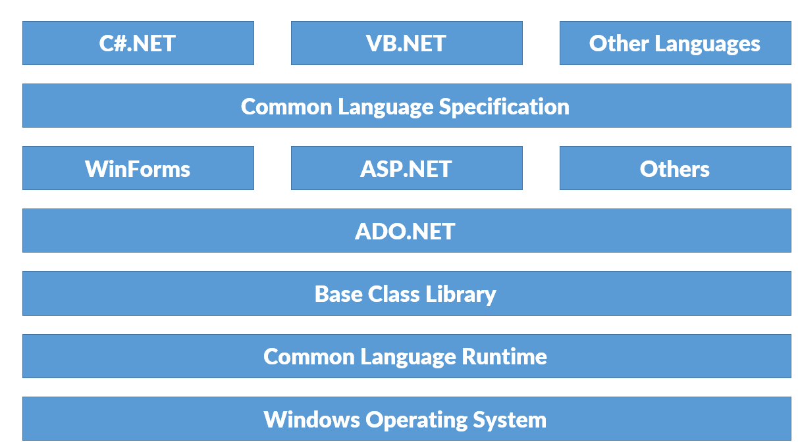

# MS .NET Architecture

Module Agenda

- What is .NET?
- .NET Architecture Overview

### What is .NET?

.NET is a general-purpose development platform. It has several key features, such as support for multiple programming languages, asynchronous and concurrent programming models, and native interoperability, which enable a wide range of scenarios across multiple platforms.

MS .NET a **Software Development Kit (SDK)** which contains many components such as CIL, CLR, FCL, CLS, which is used to develop & run the .net applications. It should be installed in both developer system and user system.

.NET Framework download link:

https://www.microsoft.com/en-us/download/details.aspx?id=55167

System Requirements of .NET Framework:

|Software / Hardware Requirement   |Minimum  |Recommended | 
--- | --- | ---|  
|Processor|1.6 Ghz|2.3 Ghz or higher|
|RAM|1 GB|2 GB or higher|
|Hard disk free space on C: drive|2 GB|4 GB or higher|
|Operating System|Windows 7 + Service Pack 1 Windows 8 Windows 8.1 Windows 10 |Windows 10|

### .NET Architecture Overview

- **.NET framework** is divided as several components.
- **.NET Framework** Architecture explains the list of components of .NET Framework, and how they are arranged internally.

- **Windows** operating system works based on **processor**.
- **CLR** works based on **Windows Operating System**.
- **BCL** works based on **CLR**.
- **ADO.NET** works based on **BCL**.
- **WinForms**, **ASP.NET**, and **Other Frameworks** work based on **ADO.NET** and **BCL**.
- **CLS** is created based on **WinForms**, **ASP.NET** and **Other Frameworks**.
- **C#.NET**, **VB.NET**, **Other Languages** are developed based on **CLS**.
- Finally, the programmers are writing the programs by using the languages called **C#.NET**, **VB.NET** etc.

### CLS and CTS

CLS (Common Language Specification)

- **CLS** is the set of standards and rules, based on which all .net languages (C#.NET, VB.NET, VC++.NET etc.) are developed.

- The common rules are about literals, operators, identifiers, data types, type conversion, object oriented programming etc.

CTS (Common Type System)

- **CTS** is a set common data types, based on which, the data types of all .net languages (C#.NET, VB.NET, VC++.NET etc.) are developed.
- Thus, we achieve the uniform data types among all .net languages.

The following is the list of **data types of CTS**:
1. SByte
2. Byte
3. Short
4. UShort
5. Int32
6. UInt32
7. Int64
8. UInt64
9. Single
10. Double
11. Decimal
12. Char
13. String
14. Boolean

### FCL and BCL

- .NET provides a set of classes and interfaces, based on which we can develop .net applications.
- The “DLL (Dynamic Link Library)” file is a collection of namespaces; Namespace is a collection of classes and interfaces.

FCL is divided into the following parts:

1. **BCL:** BCL is a set of classes and interfaces, which can be used in all types of applications.

2. **WinForms:** This is a set of classes and interfaces, which can be used only in windows applications.

3. **ASP.NET:** This is a set of classes and interfaces, which can be used only in web applications.

4. **ADO.NET:** This is a set of classes and interfaces, which can be used in all types of applications for connecting to databases.