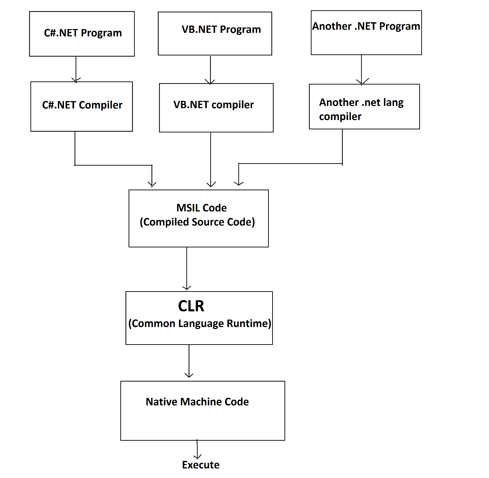
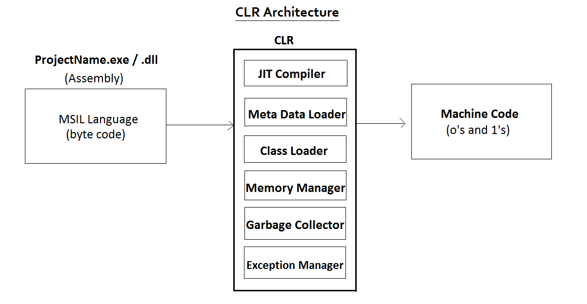

# MS .NET Program Execution Model

Module Agenda

- Execution Model of .NET Programs
- CIL (Common Intermediate Language) or MSIL
- CLR (Common Language Runtime)
- Sub Components of CLR

### Execution Model of .NET Programs

1. **Source Code:** The source code of the program is written in **.cs** file.
2. **Compilation Process:** **CSC** (C Sharp Compiler) compiles (converts) the program from **C#.NET** (programmer understandable representation) to **MSIL (Microsoft Intermediate Language)** (also called as **IL code**). The **MSIL code** will be saved in **.exe** OR **.dll** file. This EXE file can’t execute directly. The MSIL is neither understandable by the programmer, nor by operating system.
3. **Execution Process**: **CLR (Common Language Runtime)** converts the program from MSIL language at **EXE file** to **native machine language** (based on the current operating system). Operating System executes the **native machine language**. Then we will get output.

### CIL (Common Intermediate Language) or MSIL

- CIL or MSIL (Microsoft Intermediate Language) is the intermediate language, developed by Microsoft Corporation, for .NET.
- The .net programs are converted into **MSIL language** first; and then converted into **native machine language**.
- The MSIL code will be stored in **EXE** file. Ex: filename.exe. The **native machine language** code will not be saved in any file, it directly runs.
- Once the code is converted into MSIL, it doesn't matter in which .net language it is originally developed. So for all .net languages, we can have a common runtime engine called **CLR**.

### CLR (Common Language Runtime)

- CLR stands for **Common Language Runtime**.
- CLR is the **Execution Engine** or **Execution Environment** of .NET.
- To run any type of .net program (app), CLR must be installed in the computer.
- CLR will be started automatically when the .net application execution starts. CLR performs essential tasks internally, while running any .net application. Without CLR, we can’t run any .net program.
- CLR reads the **MSIL code** from the EXE file, converts the same into **native machine code**, gives the same to the operating system and then  operating system executes the native machine code; then the user gets the output. So CLR is helps the operating system while executing the .net program.
- CLR will be installed automatically as a part of **.NET Framework** software. CLR must be installed in both developer’s machine and user’s machine.

### Sub Components of CLR

CLR has the following inner components (sub components).

1. **Memory Manager:** Memory Manager is a sub component in CLR, which allocates memory (in RAM) for the variables and objects in the program.

2. **Garbage Collector:** Garbage Collector is a sub component in CLR, which deletes the variables and objects that are created during the program, automatically at the end of the program execution.

3. **Class Loader:** Class Loader is a sub component in CLR, which loads a class on-demand. When we try to access a class in the program for the first time, then the **Class Loader** searches for the class in the entire program, loads the class into the memory, and it passes the class to JIT compiler. That means if we don’t call a class, it will not be loaded into memory. This avoids un-necessary loading of the classes, if we don’t require them. So it improves performance.

4. **JIT (Just-In-Time) Compiler:** JIT Compiler is a sub component in CLR, which converts the MSIL code into **native machine language** (based on current operating system).

5. **Thread Manager:** Thread Manager is a sub component in CLR, which manages the threads of the program. It gives necessary instructions to the processor, which thread is to be executed when. A thread is a **part of the program** or **background work**.

6. **Exception Manager:** Exception Manager is a sub component in CLR, which passes necessary instructions to the operating system, which code should be executed when an exception (runtime error) occurs while executing the program.

7. **Security Manager:** Security Manager is a sub component in CLR, which takes care about different types of security in .net such as windows authentication, forms authentication, open authentication etc.

